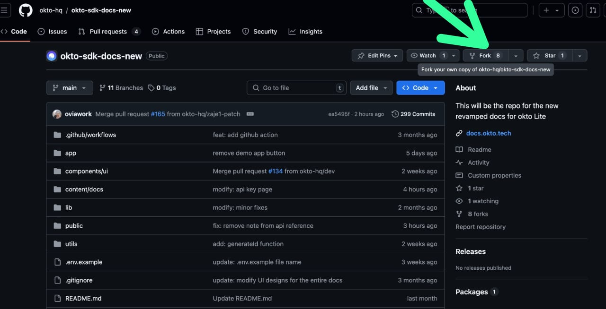

# Contributing to Okto SDK Documentation

Thank you for considering contributing to the Okto SDK Documentation! We greatly appreciate your interest in improving this project. To ensure a smooth collaboration, please follow the guidelines below.

## How to Fork the Repository


1. **Fork the Repository**  
   Click the "Fork" button in the top-right corner of the repository page to create your own copy of the Okto SDK Documentation repository.

2. **Clone Your Fork**  
   After forking, clone the repository to your local machine to work on it. Run the following command in your terminal:
   ```bash
   git clone https://github.com/your-username/okto-sdk-docs-new.git
3. **Navigate into the directory:**
    Change into the directory of the cloned repository:
    >>cd okto-sdk-docs-new


Steps to Submit a Pull Request
**1. Create a New Branch**
Before making changes, create a new branch for your work:
>>git checkout -b your-branch-name

**2. Make Changes and Commit**
Make the necessary changes to the documentation. Once done, add and commit your changes:
>>git add .
>>git commit -m "Describe your changes"

**3. Push Your Branch**
Push your branch to your GitHub repository:
>>git push origin your-branch-name

**4. Create a Pull Request**
Go to the Pull Requests section of your GitHub repository and create a new pull request (PR) with your changes


**Code Style Guidelines and Formatting Rules**
Please adhere to the following guidelines:

Code Style: Ensure your code follows the project's existing style guide.
Commit Messages: Use meaningful commit messages that describe the changes you’ve made.
Formatting: Ensure that all code is properly formatted and indented.
Tests: If possible, write tests for new features and ensure all tests pass before submitting your PR.
Thank you again for contributing to the Okto SDK Documentation! Your help is valuable in making the project better.

